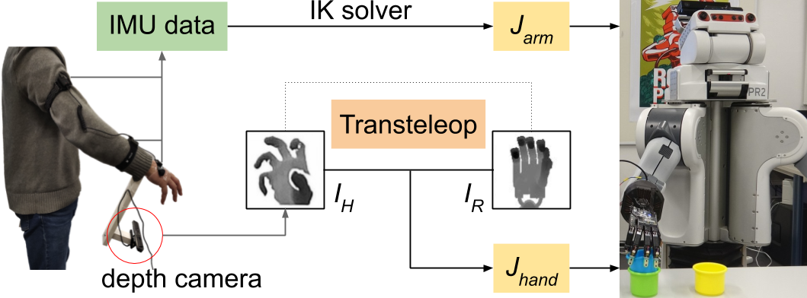

# A Mobile Robot Hand-Arm Teleoperation System by Vision and IMU

Author's mail: sli@informatik.uni-hamburg.de

This package presents a multimodal mobile teleoperation system that consists of a novel vision-based hand pose
regression network (Transteleop) and an IMU-based arm tracking method.

Please cite this paper ([A Mobile Robot Hand-Arm Teleoperation System by Vision and IMU](https://arxiv.org/abs/1809.06268)), if you use our released code.

- Project website: [https://smilels.github.io/multimodal-translation-teleop/](https://smilels.github.io/multimodal-translation-teleop/)

- Preprint: [https://arxiv.org/abs/2003.05212](https://arxiv.org/abs/2003.05212)

- Video: [https://www.youtube.com/watch?v=rAj2IWl2ezs](https://www.youtube.com/watch?v=rAj2IWl2ezs)



## Prerequisites
### OS
  - ROS Kinetic and Ubuntu 16.04
  - CUDA 10
  
### Setup   
1. Install [Anaconda](https://www.anaconda.com/download/#linux) and [PyTorch](https://pytorch.org/).
2. Install python packages in a new environment
    ```bash
    conda upgrade --all
    conda create -n teleop python=[PYTHON_VERSION] numpy ipython matplotlib mayavi yaml lxml seaborn pyyaml 
    conda activate teleop
    pip install rospkg numpy-stl tensorboardx pyquaternion pyassimp==4.1.3 visdom dominate
    ``` 
    Note: PYTHON_VERSION can be 3.7 if you do not need to use this package with ROS, otherwise use 2.7 or use python at `/usr/bin/python`
3. Clone this repo:
    ```bash
    git clone https://github.com/Smilels/multimodal-translation-teleop.git
    ```

## Dataset Generation
- Follow the steps in [TeachNet-Torch](https://github.com/Smilels/TeachNet_Teleoperation).


## Model Training/testing
- If you want to train the network yourself instead of using a pre-trained model, follow the below steps.
- To prepare your dataset, and revise the corresponding options in scripts/ae_joint_train.sh.

- To run an experiment for 200 epoch:
    ``` 
    cd Transteleop
    bash scripts/ae_joint_train.sh
    ```
    If you want to train pix2pix baseline, in [scripts](https://github.com/Smilels/multimodal-translation-teleop/tree/master/Transteleop/scripts), there has train_pix2pix.sh.

- To view training results and loss plots, run 
    ```bash
    python -m visdom.server
    ```
  and click the URL http://localhost:8097.
- To view the accuracy results, Launch a tensorboard for monitoring:
    ```bash
    tensorboard --log-dir ./assets/log --port 8080
    ```
- Test the model (bash ./scripts/test_aejoint.sh):
- The test results will be saved to a html file here: ./results/YOUR_MODEL_NAME/test_latest/index.html. 

## RealsenseSR300 Demo on simulated hand

- Launch camera RealsenseSR300([realsense-ros](https://github.com/IntelRealSense/realsense-ros), [librealsense](https://github.com/IntelRealSense/librealsense)) (If you use the other camera which is suitable for close-range tracking, please use corresponding launch file). 

- If you do not have a real camera, you can download the recorded [example rosbag](https://tams.informatik.uni-hamburg.de/people/sli/data/TeachNet_model/), and play the bag file:
    ```bash
    rosbag play [-l] example.bag
    ```
- Run Shadow hand in simulation.

- Run the demo code.

  - Change the correct topic name based on your camera.
  - Limit your right hand to the viewpoint range of [30&deg;, 120&deg;] and the distance range of [15mm, 40mm] from the camera.
  ```bash
  bash scripts/demo_moveit.sh
  ```

## Citation
If you use this code for your research, please cite our papers.
```
@inproceedings{li2020Mobilerobot,
title={A Mobile Robot Hand-Arm Teleoperation System by Vision and IMU},
author={Li, Shuang and Jiang, Jiaxi and Ruppel, Philipp and Liang, Hongzhuo and Ma, Xiaojian and Hendrich, Norman and Sun, Fuchun and Zhang, Jianwei},
journal={arXiv preprint arXiv:2003.05212},
year={2020}
}
@inproceedings{li2018vision,
  title={Vision-based Teleoperation of Shadow Dexterous Hand using End-to-End Deep Neural Network},
  author={Li, Shuang and Ma, Xiaojian and Liang, Hongzhuo and G{\"o}rner, Michael and Ruppel, Philipp and Fang, Bing and Sun, Fuchun and Zhang, Jianwei},
  booktitle={IEEE International Conference on Robotics and Automation (ICRA)},
  year={2019}
}

```

## Related Projects
Our code is inspired by
- [TeachNet-Torch](https://github.com/Smilels/TeachNet_Teleoperation)
- [pytorch-CycleGAN-and-pix2pix](https://github.com/junyanz/pytorch-CycleGAN-and-pix2pix)


